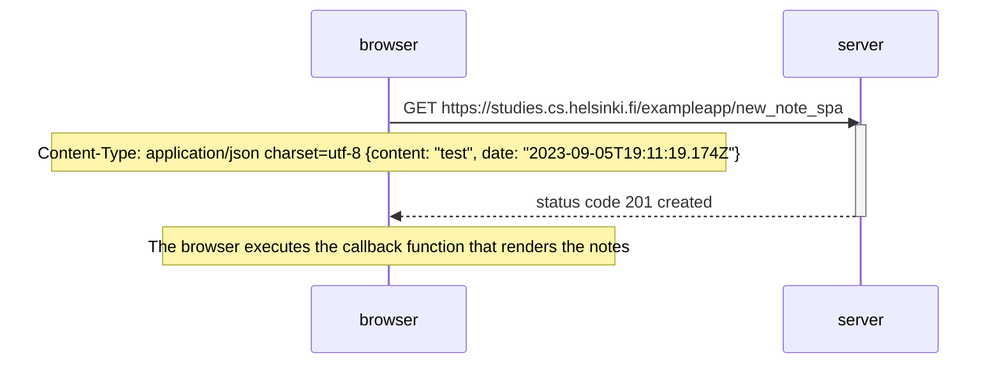

```mermaid
    sequenceDiagram
    participant browser
    participant server

    browser->>server: GET https://studies.cs.helsinki.fi/exampleapp/new_note_spa
    activate server
    Note over browser: Content-Type: application/json charset=utf-8 {content: "test", date: "2023-09-05T19:11:19.174Z"}
    server-->>browser: status code 201 created
    deactivate server
    Note over browser: The browser executes the callback function that renders the notes
```

   

   
